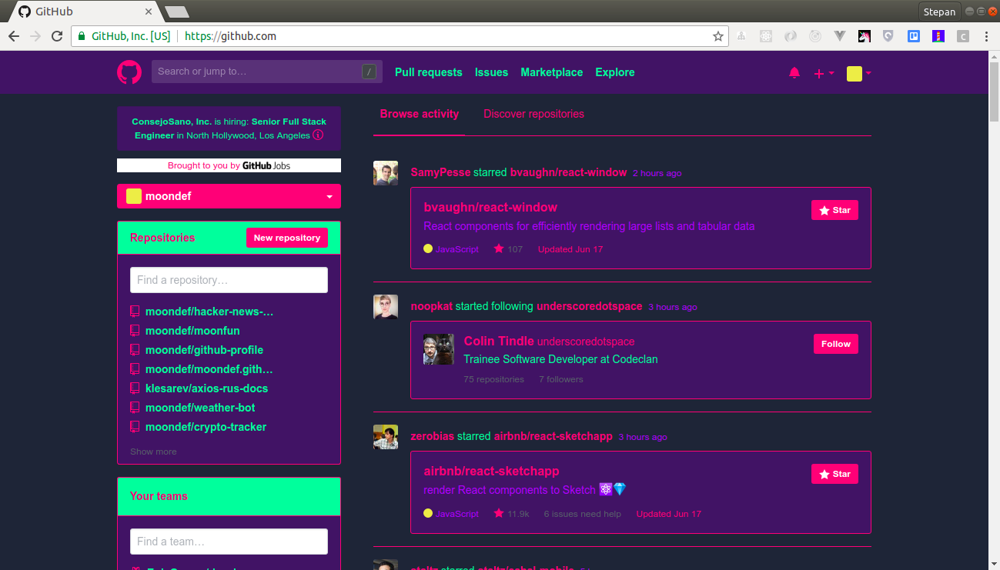
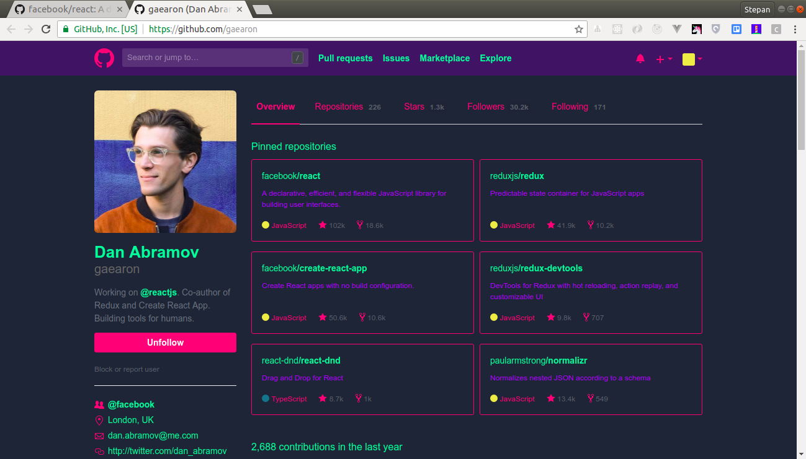
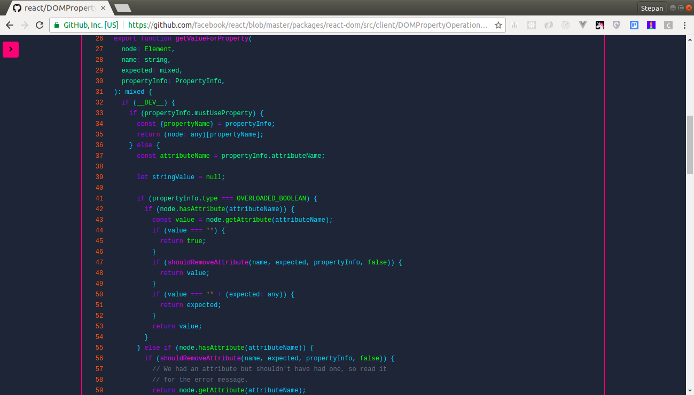

# cyberhub
## Cyberpunk theme for Github

## What is it?
**Cyberhub is an extension for the styling of the Github in the cyberpunk style**

## How to Install?
- Clone this repo: `$ git clone https://github.com/moondef/cyberhub`
- Open up `chrome://extensions` in your browser and click **Developer Mode** at the top right.
- Click on the new button **Load unpacked extension...** and select the downloaded folder.

## Screenshots

  
  
  

